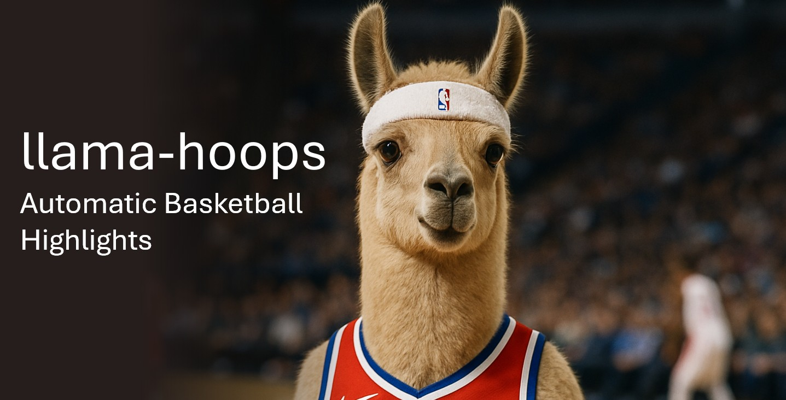
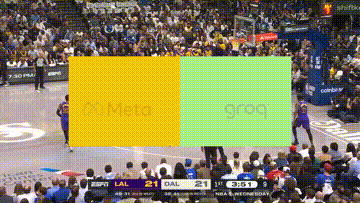

# llama-hoops
LlamaCon Hackathon 2025 Project using Llama API and Groq Inferencing to extract Basketball Highlights and compose sports clips in real-time as well as a full game summaries.

🦙 where LLama API and Groq are used:
- **event_detection.py** (Llama API - Multi-Image Understanding, Chat Completion with Structured Output & Train-of-Thought)
- **speech_to_text.py** (Groq - Transcription through Speech-to-Text)
- **text_to_speech.py** (Groq - Voice over creation through Text-to-Speech)

## ⚡ type of events
- Free Throws
- Fouls
- Steals
- Turnovers
- Timeouts
- Substitutions

## demo video
https://youtu.be/LMqbwFwGxaI

## 📄 inputs
- Video of an entire basketball match
  - During the hackathon, we used pre-recorded basketball games to simplify the developent.
  - Connecting a live stream should be easy, as the processing is done using a rolling window of video, very similar to chunks of video that would you would get from a live stream.
  - For the LlamaCon hackathon, here are two sample videos you can use: https://drive.google.com/drive/folders/113JlvpxJtrerJKni16f_hTV2FYoZ9zPM?usp=sharing

## 📺 outputs
- Individual clips from each highlight detected
- Full game narrated audio-only sumary of all highlights
- Preview of a foul highlight clip with sponsor overlay 
  

## ⚽🏈🎾 supporting other sports
- Adding support for other sports like football, soccer, tennis, is straight forward.
  - You need to identify the type of events that are relevant.
    - example for soccer: goals, corner kicks, red and yellow cards.
  - Update the prompts defined inside the folder **/prompts** to make use of those events. 

## 🧑‍💻 contributors
- Alex Amin, https://www.linkedin.com/in/alex-amin/
- Olcay Buyan, https://www.linkedin.com/in/olcaybuyan/